# ♛ N-Queens Problem: The Ultimate Simple Guide

## 🚀 What is the N-Queens Problem? 

**The N-Queens Problem** asks:  
> How can you place N chess queens on an N×N board so that no two queens threaten each other?  
(That means: no two queens in the same row, column, or diagonal!)

---

## 🧠 Why is it Famous? 

- 📚 Classic in computer science for learning **Recursion** & **Backtracking**.
- 🏆 Used in coding interviews and competitive programming.
- 💡 Foundation for harder constraint satisfaction problems.

---

## 🗺️ Visual Explanation

### 🔍 Queen Attack Patterns

Before diving into solutions, let's understand how queens attack:

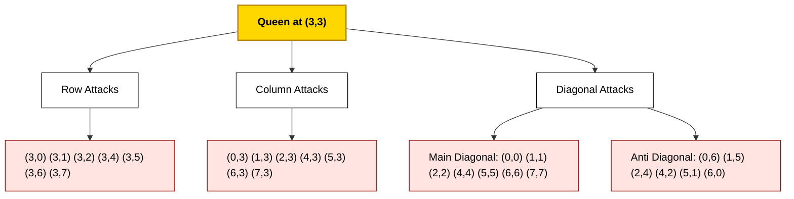

### 🟩 2x2 Chessboard: Impossible!

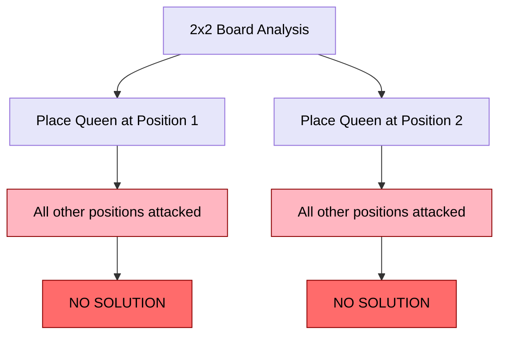

> 🔴 **There are no ways to place 2 queens—try drawing it!**

### 🟩 8x8 Chessboard: Possible!

```
Enter your chessboard dimension: 8
SOLUTION NUMBER - 1
```

## 📷 Example Screenshot

 <!-- You can save the screenshot as per your repo -->

#### ASCII Board Example

```
Q  .  .  .  .  .  .  .
.  .  .  .  Q  .  .  .
.  .  .  .  .  .  .  Q
.  .  .  .  .  Q  .  .
.  .  Q  .  .  .  .  .
.  .  .  .  .  .  Q  .
.  Q  .  .  .  .  .  .
.  .  .  Q  .  .  .  .
```
- `Q` = Queen 🟪
- `.` = Empty square

---

## 🔁 How Does the Algorithm Work? (Backtracking)

### 🧠 Core Backtracking Concept

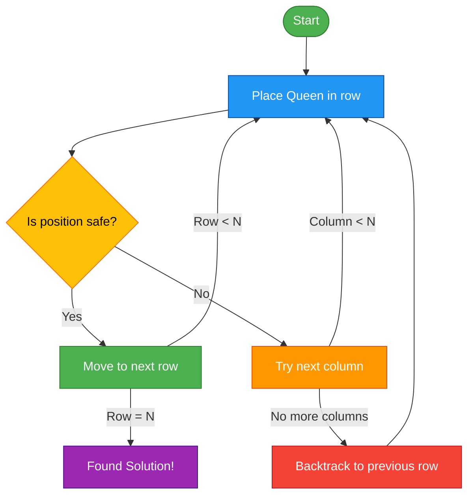

### Step-by-step (in Simple Words):

1. Start from the first row.
2. Try to place a queen in each column, one by one.
3. For each placement, check:
    - Is it safe? (No queen in same column/diagonal)
4. If safe, move to next row and repeat.
5. If you can't place a queen, **backtrack** (go up a row, move queen).
6. Repeat until you finish the board or run out of options.

### 🌳 Complete State-Space Tree for 4-Queens

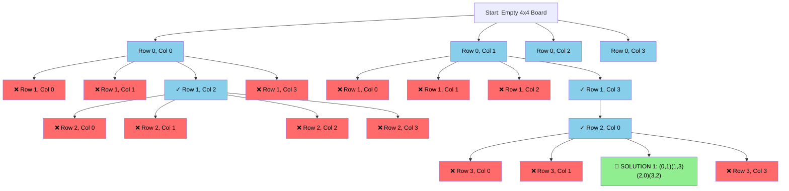

---

## 🔗 Detailed Algorithm Flowchart

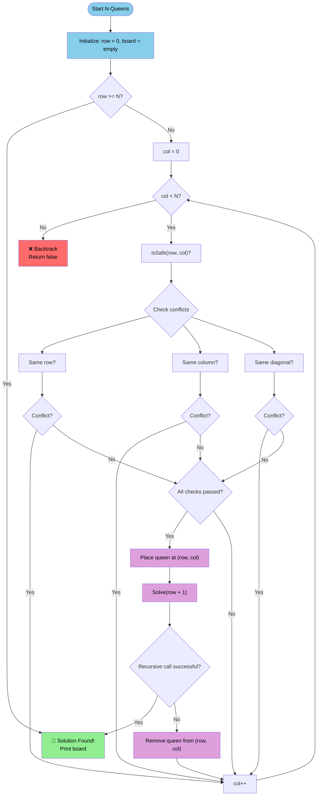

### 🔄 Recursive Call Sequence for 4-Queens

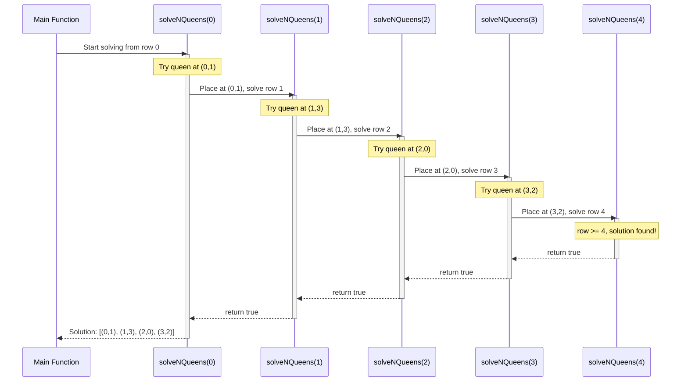

---

## 🎯 Step-by-Step Solution Timeline


### 📋 Board State Visualization

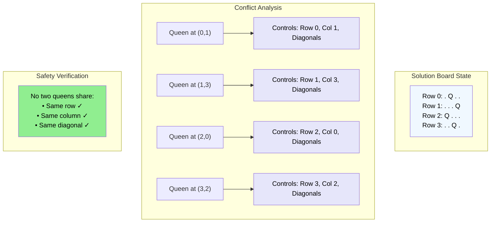

---

## 📝 Sample Code (C, Simple)

```c
bool valid_move(int k_row , int l_col , int* soln){//b5    
    for( int trav = 0 ; trav < k_row - 1 ; trav++){//b6
          bool same_diagonals = abs((trav + 1) - k_row) == abs(soln[trav] - l_col);
          bool same_col = (soln[trav] == l_col) ;
          if( same_diagonals || same_col ){//b6
              return false;
          }//b6
    }//b6
    return true;    
}//b5

void place_queen(int dxd, int k_row , int* soln){//b1 
    if(k_row > dxd){
        display(soln, dxd);
        printf("
");
        return;
    }

    
    for(int trav = 0 ; trav < dxd ; trav++){//b2
          if( valid_move(k_row , trav + 1 , soln ) ){//b3
                soln[k_row-1] = trav + 1;
                place_queen(dxd , k_row + 1 , soln);
          }//b3
    }//b2
}//b1

```

---

## 📊 Time & Space Complexity

| Algorithm    | Time Complexity | Space Complexity |
|--------------|----------------|-----------------|
| Backtracking | O(N!)          | O(N)            |

- **Time:** Worst case, you try every possible placement (factorial growth).
- **Space:** Just the board array (O(N)), plus recursion stack.

---

## 🤔 Why Backtracking?

Backtracking is like trying all options, but **giving up as soon as you know** something won't work.  
Imagine trying keys on a lock:  
- If a key doesn’t work, you put it back and try another.  
- If a key fits, you keep going!

---

### 🔍 Constraint Satisfaction Analysis

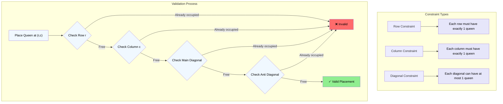

### ❌ No Solution: 2x2 Board

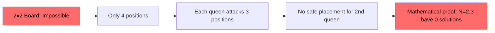

### ✅ Solution: 8x8 Board

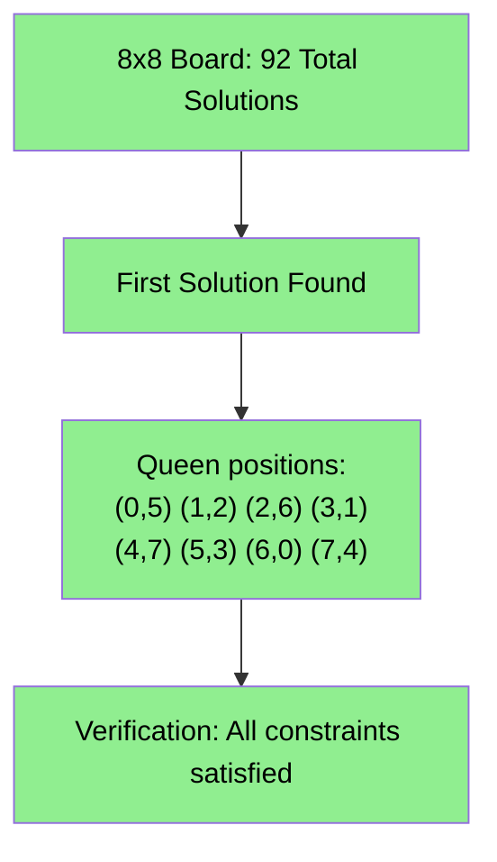

```
SOLUTION NUMBER - 1
.  .  .  .  .  ♛  .  .
.  .  ♛  .  .  .  .  .
.  .  .  .  .  .  ♛  .
.  ♛  .  .  .  .  .  .
.  .  .  .  .  .  .  ♛
.  .  .  ♛  .  .  .  .
♛  .  .  .  .  .  .  .
.  .  .  .  ♛  .  .  .
```

---

## 📚 Extra Resources

- [Wikipedia: N-Queens](https://en.wikipedia.org/wiki/Eight_queens_puzzle)
- [Visualizations & Interactive](https://www.geeksforgeeks.org/n-queen-problem-backtracking-3/)
- [LeetCode Problem](https://leetcode.com/problems/n-queens/)

---

## ⚡ Pro Tips

- Start with smaller boards (N=4 or N=5) to understand.
- Practice writing the backtracking logic from scratch.
- Use print statements to visualize the board at each step!

---

## 📊 Complexity Analysis Visualization

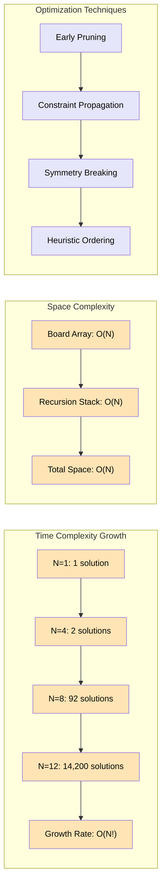

## 🏁 Summary Table

| Board Size | Number of Solutions |
|------------|---------------------|
| 1          | 1                   |
| 2          | 0                   |
| 3          | 0                   |
| 4          | 2                   |
| 5          | 10                  |
| 6          | 4                   |
| 7          | 40                  |
| 8          | 92                  |
| 9          | 352                 |
| 10         | 724                 |

---

## 🛡️ Professional Emojis Legend

- ♛ – Queen
- 🟩 – Board
- 🔁 – Loop/Recursion
- ⚡ – Tip
- 🎉 – Solution found
- ❌ – No solution
- 🧠 – Theory/Concept
- 📚 – Resource/Link

---

## ✍️ Author & Credits

- Coded and documented by [zeroisinfinity](https://github.com/zeroisinfinity)
- Guide created with 💡 and 🤖 by Copilot

---

*Happy Coding! If this helped, star the repo!* ⭐
