# 🧭 A Comprehensive Guide to Permutations using Backtracking 🧭

This guide provides a deep dive into the concept of generating permutations using a backtracking algorithm. It's designed to be a general resource, not an explanation of a specific codebase.

---

## 🧐 What are Permutations?

In mathematics, a permutation of a set is, loosely speaking, an arrangement of its members into a sequence or linear order, or if the set is already ordered, a rearrangement of its elements. For example, for the set `{1, 2, 3}`, the six permutations are:

-   `(1, 2, 3)`
-   `(1, 3, 2)`
-   `(2, 1, 3)`
-   `(2, 3, 1)`
-   `(3, 1, 2)`
-   `(3, 2, 1)`

The number of permutations of a set of 'n' distinct elements is **n!** (n-factorial).

---

## 🚀 The Backtracking Approach

Backtracking is a general algorithmic technique for solving problems recursively by trying to build a solution incrementally, one piece at a time, removing those solutions that fail to satisfy the constraints of the problem at any point in time.


For generating permutations, we can think of building a permutation step-by-step.

### 💡 The Core Idea

1.  **Choose:** Choose an available element from the set. ✅
2.  **Explore:** Add the chosen element to the current permutation and recursively explore the remaining elements. 🗺️
3.  **Unchoose (Backtrack):** Once the recursive call returns, remove the element you just added so you can explore other possibilities. ↩️

This "choose, explore, unchoose" pattern is the heart of backtracking. Here is a state diagram that models this cycle:


### 🌳 Visualizing with a State-Space Tree

We can visualize the backtracking process as a traversal of a "state-space tree". The root of the tree represents the initial state (an empty permutation), and the children of a node represent the next possible choices. The leaves of the tree are the complete permutations.

Here is a Mermaid graph that shows the state-space tree for permutations of `{1, 2, 3}`:

```mermaid
graph TD
    A["[]"] --"Choose 1"--> B["[1]"]
    A["[]"] --"Choose 2"--> C["[2]"]
    A["[]"] --"Choose 3"--> D["[3]"]
    B --"Choose 2"--> E["[1,2]"]
    B --"Choose 3"--> F["[1,3]"]
    C --"Choose 1"--> G["[2,1]"]
    C --"Choose 3"--> H["[2,3]"]
    D --"Choose 1"--> I["[3,1]"]
    D --"Choose 2"--> J["[3,2]"]
    E --"Choose 3"--> K["[1,2,3] ✓"]
    F --"Choose 2"--> L["[1,3,2] ✓"]
    G --"Choose 3"--> M["[2,1,3] ✓"]
    H --"Choose 1"--> N["[2,3,1] ✓"]
    I --"Choose 2"--> O["[3,1,2] ✓"]
    J --"Choose 1"--> P["[3,2,1] ✓"]
    
    classDef solution fill:#90EE90,color:#000000
    class K,L,M,N,O,P solution
```



Each path from the root to a leaf represents a unique permutation. The backtracking algorithm essentially performs a depth-first search (DFS) on this tree.

### ✍️ Pseudocode

Here is a general pseudocode representation of the algorithm:

```
function findPermutations(list, current_permutation):
  // Base Case: If the list of available elements is empty,
  // we have a complete permutation.
  if list is empty:
    add current_permutation to the list of solutions
    return

  // Recursive Step: Iterate through all available elements
  for each element in list:
    // 1. Choose
    new_permutation = current_permutation + element
    remaining_list = list - element

    // 2. Explore
    findPermutations(remaining_list, new_permutation)

    // 3. Unchoose (This happens implicitly in the loop as we
    //    start the next iteration with the original 'list' and 'current_permutation')
```

And here is a flowchart of the algorithm:


---

## 👣 Example Walkthrough

Let's trace `findPermutations({1, 2, 3}, {})`:

1.  `findPermutations({1, 2, 3}, {})`
    *   Choose `1`. Call `findPermutations({2, 3}, {1})`
        *   Choose `2`. Call `findPermutations({3}, {1, 2})`
            *   Choose `3`. Call `findPermutations({}, {1, 2, 3})`
                *   **Base case hit!** Add `{1, 2, 3}` to solutions. Return. ✅
        *   (Backtrack) ↩️
        *   Choose `3`. Call `findPermutations({2}, {1, 3})`
            *   Choose `2`. Call `findPermutations({}, {1, 3, 2})`
                *   **Base case hit!** Add `{1, 3, 2}` to solutions. Return. ✅
    *   (Backtrack) ↩️
    *   Choose `2`. Call `findPermutations({1, 3}, {2})`
        *   ... and so on.

To better visualize the recursion, here is a sequence diagram for `findPermutations({1, 2}, {})`:


Here is a timeline diagram showing the execution flow for the same example. This helps visualize the order and nesting of the recursive calls.


*(Placeholder for a screenshot of a code example)*

---

## 📚 Helpful Resources

*   **GeeksforGeeks:** [Write a program to print all permutations of a given string](https://www.geeksforgeeks.org/write-a-program-to-print-all-permutations-of-a-given-string/)
*   **YouTube Video:** [Backtracking Algorithm Explained](https://www.youtube.com/watch?v=s7AvT7cGdSo)

*(Placeholder for your own screenshots or links)*
